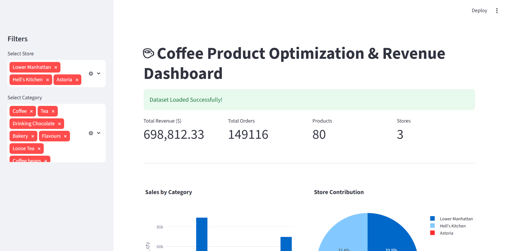
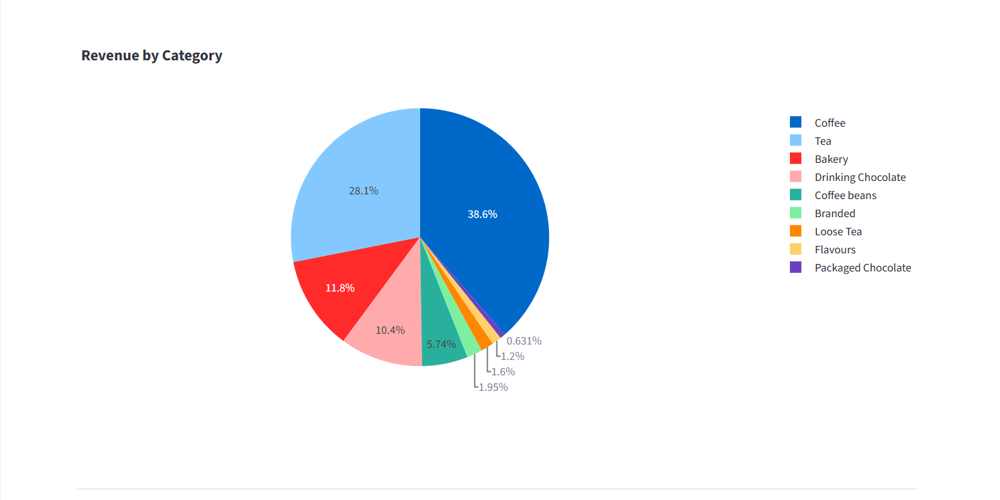
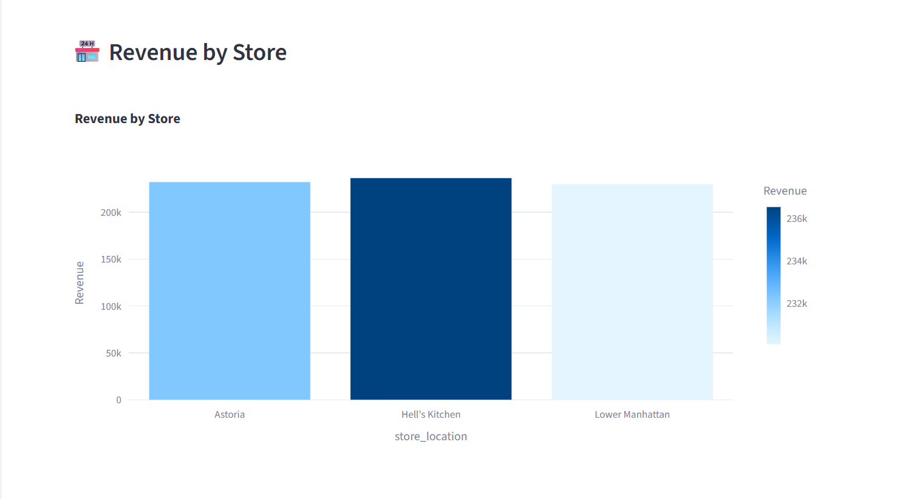
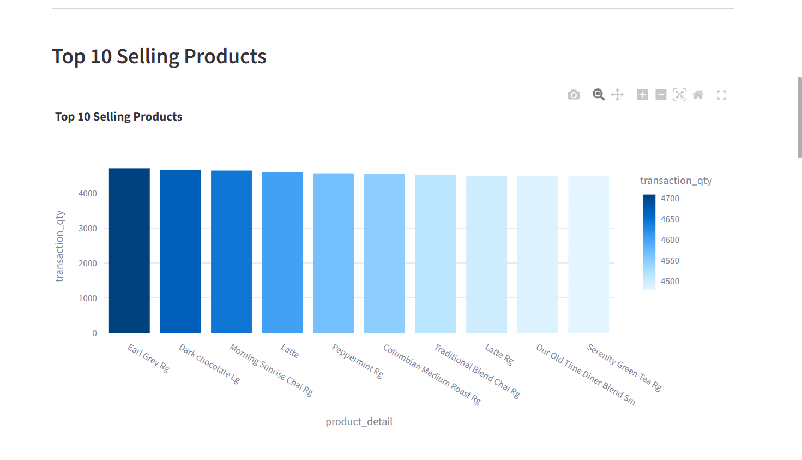
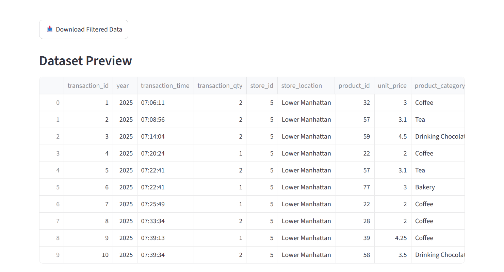
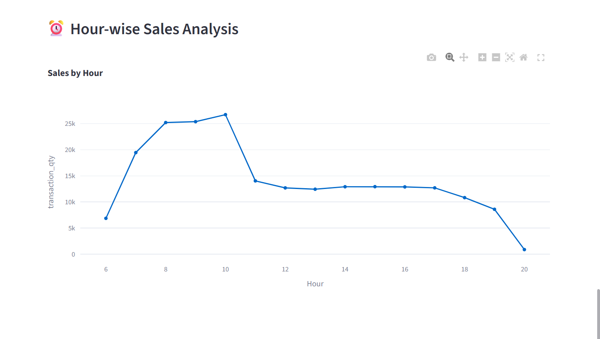

# ☕ Coffee Product Optimization & Revenue Dashboard

## 📌 Project Overview

The Coffee Product Optimization & Revenue Dashboard is an interactive data analytics dashboard built using Python and Streamlit. It helps analyze coffee shop sales data to identify revenue trends, best-selling products, store performance, category-wise sales, and hourly sales patterns.

This dashboard allows users to filter data by store and product category, making business insights easy to understand through interactive visualizations.

---

## 🚀 Features

- 📊 Interactive Dashboard
- 🏪 Store-wise Revenue Analysis
- ☕ Category-wise Sales Analysis
- 🥇 Top 10 Best Selling Products
- 🕒 Hour-wise Sales Analysis
- 📈 Revenue Distribution Charts
- 📋 Dataset Preview
- 📌 Business Insights
- 📥 Download Filtered Data (CSV)
- 🎛 Interactive Filters for Store and Category

---

## 🛠 Technologies Used

- Python
- Streamlit
- Pandas
- Plotly Express
- Plotly Graph Objects

---

## 📂 Dataset

The dataset contains coffee shop transaction details including:

- Transaction ID
- Store Location
- Product Category
- Product Name
- Quantity Sold
- Unit Price
- Revenue
- Transaction Time

---

## 📊 Dashboard Visualizations

- Dashboard Overview
- Sales by Category
- Store Contribution
- Top 10 Selling Products
- Revenue by Store
- Revenue by Category
- Dataset Preview
- Dashboard Insights
- Hour-wise Sales Analysis

---

## 📥 Installation

Clone the repository

```bash
git clone https://github.com/YOUR_USERNAME/YOUR_REPOSITORY.git
```

Move into project folder

```bash
cd YOUR_REPOSITORY
```

Install dependencies

```bash
pip install -r requirements.txt
```

Run the application

```bash
streamlit run app.py
```

---

## 📷 Dashboard Screenshots

### Dashboard Home



### Sales by Category & Store Contribution





### Top 10 Selling Products



### Revenue by Store


### Revenue by Category


### Dataset Preview



### Hour-wise Sales Analysis



---

## 📌 Dashboard Insights

- Coffee category generates the highest revenue.
- Hell's Kitchen store performs better than other stores.
- Morning hours (8 AM–10 AM) record maximum sales.
- Top 10 products contribute significantly to overall sales.
- Interactive filters make analysis simple and effective.

---

## 📁 Project Structure

```
Coffee Dashboard/
│
├── app.py
├── requirements.txt
├── README.md
├── coffee.csv
└── screenshots/
```

---

## 🔮 Future Improvements

- Machine Learning Sales Prediction
- Demand Forecasting
- Customer Segmentation
- Profit Analysis
- Monthly Revenue Forecast

---

## 👨‍💻 Author

**Karan Kumar Soni**

B.Tech (Computer Science & Engineering)

Data Science Enthusiast

---

## ⭐ If you like this project, don't forget to Star the repository!